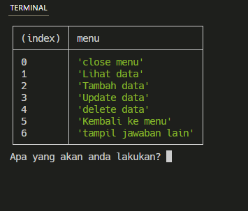
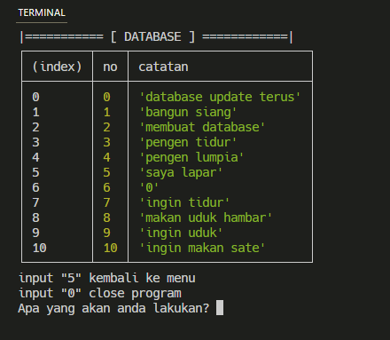
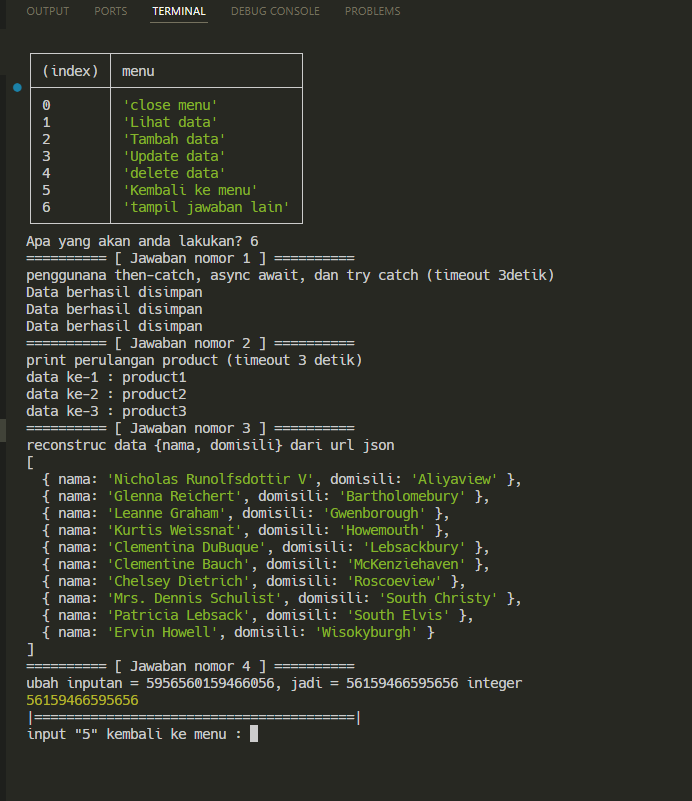

# week-2-weeklyTask
weekly task 2 Bootcamp koda batch 3

Write command ``npm start`` in terminal to run the program 

it will show menu like this, this application main to keep catatan (notes)

and for data saved in ("./data/my_database.json"), the list saved data would be like this 

and for menu "6. tampil jawaban lain" would be like this
 